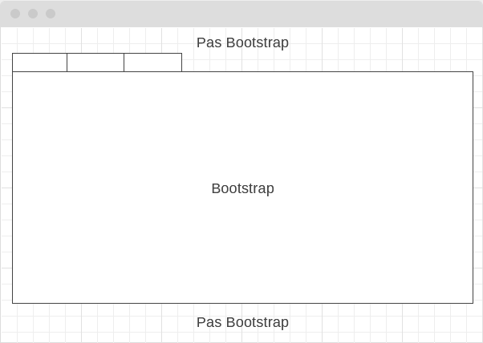

---
{"date":"2020-06-24T15:52:54+02:00","tags":["bootstrap","css","less"],"publish":true,"created":"2025-05-01T15:10","updated":"2025-05-10T10:08:40.154+02:00","PassFrontmatter":true}
---


J’ai eu a créer une page avec Bootstrap dans un site n’utilisant pas Bootstrap



Bootstrap gérant l’apparence de toute la page, il fallait l’isoler dans une classe pour ne pas créer de conflits

Voici comment procéder :

1. Télécharger la version compilée de [Bootstrap](https://getbootstrap.com/docs/4.5/getting-started/download/)
2. Installer [LESS](http://lesscss.org/)
```sh
npm install -g less
```
3. Créer un fichier prefix.less dans le dossier du css de Bootstrap 
```less
.bootstrap {
   @import (less) 'bootstrap.css';
}
```
4. Exécuter en ligne de commande 
```sh
lessc --math=strict prefix.less bootstrap-prefixed.css
```
  
  Vous aurez donc un fichier bootstrap-prefixed.css avec toutes les règles incluses dans une classe <span class="lang:default highlight:0 decode:true crayon-inline">.bootstrap</span>
5. Il y a quelques corrections à apporter au début du fichier bootstrap-prefixed.css au niveau des règles appliquées à <span class="lang:default highlight:0 decode:true crayon-inline">:root</span> et <span class="lang:default highlight:0 decode:true crayon-inline">body</span> :  
  enlever <span class="lang:default highlight:0 decode:true crayon-inline">.bootstrap</span> de <span class="lang:default highlight:0 decode:true crayon-inline">:root</span> et remplacer<span class="lang:default highlight:0 decode:true crayon-inline">.bootstrap body</span> par <span class="lang:default highlight:0 decode:true crayon-inline">.bootstrap</span>

Et voilà, vous pouvez utiliser ce fichier pour avoir le style de Bootstrap dans un élément ayant la classe <span class="lang:default highlight:0 decode:true crayon-inline">.bootstrap</span>.

Cela pouvait surement se faire en sass et j’aurais préféré, Bootstrap utilisant Sass, mais je n’ai pas trouvé de méthode simple.

Sources :
- [How to Isolate Bootstrap CSS to Avoid Conflicts](https://formden.com/blog/isolate-bootstrap)
- [Importing css as less #28419](https://github.com/twbs/bootstrap/issues/28419)