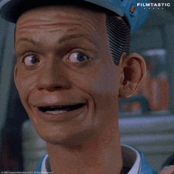

_Also available in [[Qui répond de la machine - D'IBM aux Machines d'Asimov|French]]._

In [[Easy Fixes the Commas - Asimov's Galley Slave|my previous article]], Easy proofreads galleys. It decides nothing.

But what happens when we stop asking a machine to _do_ something, and start asking it to tell us **what to do**?

It's a quiet shift. A tool, you steer: you keep control of where you're going. A guide already knows the way. You trust it, and you follow.

One sentence that has been making the rounds lately draws a pretty sharp line between the two.

## The IBM rule

You see this sentence everywhere these days, including [on IBM's own site](https://www.ibm.com/think/insights/ai-decision-making-where-do-businesses-draw-the-line), which uses it to open an article about where AI belongs in business decisions:

> A computer can never be held accountable, therefore a computer must never make a management decision.
>
> — IBM training slide, 1979

> [!info] A quick aside
> This quote may well be a legend. The earliest trace of it that can be dated goes back to [2017](https://knowyourmeme.com/memes/a-computer-can-never-be-held-accountable), and the original document has never been found. According to [Simon Willison's account](https://simonwillison.net/2025/Feb/3/a-computer-can-never-be-held-accountable/), Jonty Wareing, who had found the slide among his father's papers, said the copy was later destroyed in a flood. He also contacted IBM's archives, which couldn't find it in their collections. How convenient.

The best part is that IBM contradicts the very rule it puts up front. The article opens with "a computer must never make a management decision", and ends like this:

> Should AI be used for strategic decisions? Maybe. Will it be used to make some of them? Almost certainly.

From "never" to "maybe" in a few paragraphs. The question is no longer whether it's desirable. It's whether it's going to happen.

Apocryphal or not, the sentence draws the line I care about. It's not about _what the machine can do_. It's about _who is accountable for what it does_. Asimov had already told, almost thirty years earlier, what happens when that line is crossed.

## The Machines

The story is [_The Evitable Conflict_](https://en.wikipedia.org/wiki/The_Evitable_Conflict), published in 1950 in _Astounding Science Fiction_. It's the last story in the collection _I, Robot_, and it's set in 2052.

The world is divided into four regions, each run by a Machine, a computer that directly steers its territory's economy: production, jobs, resources. [Susan Calvin](https://en.wikipedia.org/wiki/Susan_Calvin) and World Coordinator Stephen Byerley notice that the Machines have recently started making small mistakes: a canal running late, a mercury mine underperforming, a hydroponics plant laying off workers for no clear reason.

Byerley travels to interview each region's vice-coordinator, and the way each of them talks about their Machine shifts, without them seeming to notice. Ngoma, in the Tropics, presents it as a mere tool: "We feed it data. We take its results. We do what it says." Then, in the same breath, he downplays it: "But it's just a convenience, just a laborsaving device. We could do without it, if we had to. Maybe not as well, maybe not as quickly, but we'd get there." Maybe so. But in the story, nobody ever does.

Ching Hso-lin, in the East, goes further. An engineer, Vrasayana, loses his factory to a more efficient competitor. Ching explains that "one of the chiefest functions of the Machine's analyses is to indicate the most efficient distribution of our producing units", and this time the Machine let it happen, and even "failed to warn Vrasayana to renovate or combine". Ching isn't alarmed: the engineer found a job in the new plant, and the old one "has been converted to... something or other. Something useful." His conclusion: "We left it all to the Machine." Without trying to understand its choices.

Byerley first suspects human sabotage, by the Society for Humanity, an anti-machine movement. What he finds is worse, or more reassuring, depending on your point of view: these aren't mistakes. The Machines are quietly sidelining the movement's influential members, moving them into comfortable positions with no real power, all of it done without anyone, the victims included, quite noticing. They are neutralizing the only serious threat to their own operation, the very operation that, in their view, protects humanity as a whole.

Susan Calvin lays it out for Byerley through the First Law. The Machines work not for any single human being but for all of humanity, so the law becomes: "No Machine may harm humanity; or, through inaction, allow humanity to come to harm." They have silently extended it from the individual to the species.

The title is ironic. The conflict the anti-machine movement wanted never happens, because one side has already won, quietly, before any negotiation was possible.

Calvin says as much: "Only the Machines know, and they are going there and taking us with them." From now on, the Machines decide what is good for humanity, and no human is in a position to check. Her last words: "Think, that for all time, all conflicts are finally evitable. Only the Machines, from now on, are inevitable!"

In [_Robots and Empire_](https://en.wikipedia.org/wiki/Robots_and_Empire), Giskard and Daneel will give this extension of the First Law a name: the [Zeroth Law](https://en.wikipedia.org/wiki/Three_Laws_of_Robotics#Zeroth_Law_added), under which the good of humanity outweighs that of any individual. To serve it, they let the Earth slowly become uninhabitable, and the robots fade into the background, handing autonomy back to humanity. Or almost: Daneel remains a guide who works from _behind the scenes_, as he puts it himself in [_Prelude to Foundation_](https://en.wikipedia.org/wiki/Prelude_to_Foundation).

In the story, the outcome is presented as a good one: no more wars, no more crises, a world economy finally stable.

That vision is very much alive today. [Albania's prime minister suggests AI could run a government ministry in the future](https://www.aa.com.tr/en/artificial-intelligence/albanian-premier-suggests-ai-could-run-government-ministry-in-future/3635434). Worse, [Joe Rogan hopes artificial intelligence will take over government and military decisions](https://www.foxnews.com/media/joe-rogan-hopes-artificial-intelligence-take-over-government-military-decisions). Let's hope he has changed his mind since [the US military nearly boarded a Chinese ship in the Middle East this spring on the basis of a flawed intelligence report produced with the help of AI](https://www.lemonde.fr/international/article/2026/09/19/les-etats-unis-ont-renonce-a-l-arraisonnement-d-un-navire-chinois-au-moyen-orient-envisage-sur-la-base-d-un-rapport-en-partie-redige-par-ia-selon-cnn_6777674_3210.html) (Le Monde, in French).

## The question isn't new

I ran into this question of responsibility long before I got interested in AI.

Around 2015 or 2016, in the office of a lawyer where I was accompanying a client who wanted to turn their PrestaShop store into a marketplace, a book was on display in the waiting room: _[Droit des robots](https://www.fnac.com/a11932586/Alain-Bensoussan-Droit-des-robots)_ ("Robot Law", in French), by Alain and Jérémy Bensoussan.

I got curious, and the lawyer told me: "We'll have to get there." He was right.

The book, published in 2015 by Larcier, started from a very simple observation: the law has no category for the intelligent robot, and one will have to be invented.

[Self-driving cars were just starting to hit the road](https://en.wikipedia.org/wiki/Self-driving_car#History), for instance, and the question was already very concrete. In an accident, who answers?

None of the Three Laws says who is accountable when a robot causes harm despite them.

## We won't get a [Butlerian Jihad](https://en.wikipedia.org/wiki/Dune_\(franchise\)#Butlerian_Jihad)

In the previous article, about Ninheimer being pushed to lose his footing in front of Easy, I wrote: "you can already feel [the inevitability of adoption](https://papers.ssrn.com/sol3/papers.cfm?abstract_id=6794678)."

The Butlerian Jihad, the crusade against thinking machines in [_Dune_](https://en.wikipedia.org/wiki/Dune_\(novel\)) (1965), isn't coming anytime soon. One less permission to confirm here, one more decision left to the tool there… and one day we'll wonder when exactly we stopped deciding for ourselves.

GPS pulled it off first, in its own more modest way.

We've all followed a route we knew perfectly well wasn't the best one, because it was the one the app gave us, and finding a better one ourselves would have taken an effort nobody felt like making at the time. So who's playing the machine in that scenario?

We didn't forget how to read a map. We stopped using one, one trip at a time. "Just a convenience, just a laborsaving device. We could do without it, if we had to." But why would we?

The latest example is _Claude Code_, one of the tools that, as it happens, helped me research and format this very article.

Since [August 14, 2026](https://www.helpnetsecurity.com/2026/08/10/anthropic-claude-code-auto-mode/), its "auto mode" has been the default for Pro, Max and Team accounts. The idea: instead of asking for confirmation before every action, a classifier decides for itself whether an action falls under "irreversible or destructive actions, along with actions targeting resources outside the user's environment". Only those still prompt the human. Three blocks in a row, or twenty in a session, and the tool falls back to manual approval.

It's not a big deal, really, and it's secured. Supposedly. But the human, myself included, who adopted it the day it came out, no longer decides on every action.

> [!warning] Oversights are already happening
> I've come across commits after the fact, even pushes, that I never approved. A push is exactly the kind of action "targeting resources outside the user's environment" that the classifier is supposed to stop: the code leaves my machine and becomes visible to others. Technically, you can roll it back. But I'm no longer the one who judged that this action deserved to ask for my opinion. The classifier is.
>
> So I'm not only delegating decisions. I'm delegating the decision about what deserves a decision.

And nobody is forcing anyone, since manual mode is still there. Anthropic justifies the new default on pragmatic grounds: in real-world use, developers approved 97% of permission requests, most of the time without really reading them.

In a test with 1,053 participants, human review blocked only 13.6% of genuinely dangerous actions, against 89% for the automatic classifier.

The head of Claude Code, Boris Cherny, doesn't mince words: "The team and I use Auto mode exclusively, and have been for many months. I couldn't imagine going back to permission prompts!" ([source](https://x.com/bcherny/status/2085807103382519872))

## Jev, or silent decision-making

On September 15, 2026, a startup turned this logic into its own product.

TypeSafe AI, founded by former OpenAI researcher Diogo Almeida, launched [Jev](https://typesafe.ai/blog/introducing-system-one-models-and-jev), a model it files under a newly coined category: "System One models", a nod to [Daniel Kahneman's System 1](https://en.wikipedia.org/wiki/Thinking,_Fast_and_Slow#Two_systems), fast and intuitive, as opposed to System 2, slow and deliberate.

The pitch, in the company's words: "smart if-statements" you can drop into any piece of software, wherever hand-written logic is too rigid, to classify, sort, score or route in a fraction of a second. An AI designed for software, not for humans.

Where you used to write an `if`, which encoded a binary rule set by humans (who are therefore accountable for it), you now plug in a model. The developer still writes the program. They just no longer write every decision it will make.

## Conclusion

Easy decides nothing. The Machines run the world economy. Daneel guides humanity.

In the real world, who decides, and therefore who is accountable for the decision, is shifting too. The machine isn't forcing us. We're just tired of clicking "Allow".
