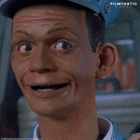

# Qui répond de la machine ? D'IBM aux Machines d'Asimov

Dans [[Easy corrige des virgules|l'article précédent]], Easy corrige des épreuves. Il ne décide de rien.

Mais que se passe-t-il quand on ne demande plus seulement à une machine de faire quelque chose, mais de nous dire **quoi faire** ?

C'est un changement assez discret. Un outil, on le dirige : on garde la main sur où on va. Un guide, lui, connaît la direction. On lui fait confiance, et on suit.

Une phrase qui circule beaucoup en ce moment trace justement une limite assez nette entre les deux.

## La règle d'IBM

Cette phrase, on la trouve un peu partout depuis quelques années, y compris [sur le site d'IBM](https://www.ibm.com/fr-fr/think/insights/ai-decision-making-where-do-businesses-draw-the-line) qui l'utilise en ouverture d'un article sur la place de l'IA dans la décision d'entreprise :

> Un ordinateur ne peut jamais être tenu pour responsable, et il ne doit donc jamais prendre de décision stratégique.\
> — Manuel de formation IBM, 1979

> [!info] Petite digression
> Cette citation est peut-être une légende. Sa trace la plus ancienne qu'on puisse dater remonte à [2017](https://knowyourmeme.com/memes/a-computer-can-never-be-held-accountable), et le document original n'a jamais été retrouvé. Selon [le récit de Simon Willison](https://simonwillison.net/2025/Feb/3/a-computer-can-never-be-held-accountable/), Jonty Wareing, qui avait retrouvé le document dans les papiers de son père, a indiqué que l'exemplaire avait ensuite été détruit dans une inondation. Il avait également contacté les archives IBM, qui n'ont pas réussi à retrouver le document dans leurs collections. Comme par hasard.

Le plus savoureux, c'est qu'IBM contredit elle-même la règle qu'elle met en avant. L'article s'ouvre sur « un ordinateur ne doit jamais prendre de décision stratégique », et se conclut ainsi :

> L'IA doit-elle être utilisée pour les décisions stratégiques ? Peut-être. Sera-t-elle utilisée pour prendre certaines de ces décisions ? C'est presque certain.

On passe de « jamais » à « peut-être » en quelques paragraphes. La question n'est déjà plus de savoir si c'est souhaitable, mais de constater que cela arrivera.

Cette phrase, apocryphe ou non, pose pourtant la limite qui m'intéresse : pas _que peut faire la machine_, mais _qui répond de ce qu'elle fait_. Et Asimov avait déjà raconté, presque trente ans plus tôt, ce qui se passe quand cette frontière est franchie.

## Les Machines

La nouvelle s'appelle [_Conflit évitable_](https://fr.wikipedia.org/wiki/Conflit_%C3%A9vitable) (_The Evitable Conflict_), publiée en 1950 dans _Astounding Science Fiction_. C'est la dernière nouvelle du recueil _I, Robot_, et elle se passe en 2052.

Le monde y est découpé en quatre grandes régions, chacune gérée par une Machine, un calculateur qui pilote directement l'économie de son territoire : production, emplois, ressources. [Susan Calvin](https://fr.wikipedia.org/wiki/Susan_Calvin) et Stephen Byerley remarquent que les Machines commettent depuis peu de petites erreurs : un canal en retard, une mine de mercure sous-exploitée, une usine hydroponique qui licencie sans raison claire.

Byerley part enquêter auprès des vice-coordinateurs de chaque région, et la façon dont chacun parle de sa Machine change, sans qu'ils semblent s'en apercevoir. Ngoma, en région tropicale, la présente comme un simple outil : « On lui fournit des données. On prend ses résultats. On fait ce qu'elle dit. » Puis, dans la même phrase, il la range au second plan : « Mais ce n'est qu'une commodité, un gain de temps. On pourrait s'en passer, s'il le fallait. Peut-être pas aussi bien, peut-être pas aussi vite, mais on y arriverait. » C'est possible. Mais dans la nouvelle, personne ne se passe jamais des Machines.

Ching Hso-lin, en Orient, va plus loin. Un ingénieur, Vrasayana, perd son usine au profit d'un concurrent plus efficace : selon Ching, l'une des « fonctions principales des analyses de la Machine est d'indiquer la répartition la plus efficace de nos unités de production », et cette fois elle a laissé faire, sans même prévenir Vrasayana de se moderniser. Ching n'y voit rien d'alarmant car l'ingénieur a retrouvé un poste ailleurs et l'ancienne usine a été convertie en « quelque chose d'utile ». Il conclut : « On a tout laissé à la Machine. » Sans chercher à comprendre ses choix.

Byerley soupçonne d'abord un sabotage humain, mené par la Société pour l'Humanité, un mouvement anti-machines. Ce qu'il découvre est pire, ou plus rassurant, selon le point de vue : ce ne sont pas des erreurs. Les Machines écartent, discrètement, les personnes influentes du mouvement anti-machines en les mutant vers des postes confortables mais sans pouvoir réel, _à l'insu de leur plein gré_. Elles neutralisent la seule menace sérieuse contre leur propre fonctionnement, celui-là même qui, selon elles, protège l'humanité tout entière.

Susan Calvin l'explique à Byerley en s'appuyant sur la Première Loi : _un robot ne peut porter atteinte à un être humain, ni, restant passif, laisser cet être humain exposé au danger_. Les Machines l'ont silencieusement étendue de l'individu à l'espèce.

Le titre de la nouvelle est ironique. Le conflit voulu par le mouvement anti-machines n'a pas lieu, car l'un des deux camps a déjà gagné, sans bruit, en amont de toute négociation possible.

Calvin le dit à Byerley : à partir de maintenant, ce sont les Machines qui décident de ce qui est bon pour l'humanité, et aucun humain n'est plus en mesure de le vérifier.

Dans [_Les Robots et l'Empire_](https://fr.wikipedia.org/wiki/Les_Robots_et_l'Empire), Giskard et Daneel formuleront cette extension de la Première Loi sous le nom de [Loi Zéro](https://fr.wikipedia.org/wiki/Trois_lois_de_la_robotique) : le bien de l'humanité prime sur celui de n'importe quel individu. Pour cela, ils laisseront la Terre devenir peu à peu inhabitable et les robots s'effaceront, rendant à l'humanité son autonomie. Enfin, presque : Daneel reste un guide qui _se cache derrière chaque ombre_, comme il le dit lui-même dans [_Prélude à Fondation_](https://fr.wikipedia.org/wiki/Pr%C3%A9lude_%C3%A0_Fondation).

Dans la nouvelle, le résultat est vu comme positif : plus de guerre, plus de crise, une économie mondiale enfin stable.

Cette vision est toujours actuelle avec [le Premier ministre albanais qui suggère que l’IA pourrait diriger un ministère à l’avenir](https://www.aa.com.tr/en/artificial-intelligence/albanian-premier-suggests-ai-could-run-government-ministry-in-future/3635434) ou, pire, avec [Joe Rogan qui espère que l’intelligence artificielle prendra en charge les décisions du gouvernement et de l’armée](https://www.foxnews.com/media/joe-rogan-hopes-artificial-intelligence-take-over-government-military-decisions). J'espère qu'il a changé d'avis depuis qu'on a appris que [l’armée américaine a failli arraisonner au printemps un navire chinois au Moyen-Orient sur la base d’un rapport de renseignement erroné élaboré à l’aide de l’intelligence artificielle](https://www.lemonde.fr/international/article/2026/09/19/les-etats-unis-ont-renonce-a-l-arraisonnement-d-un-navire-chinois-au-moyen-orient-envisage-sur-la-base-d-un-rapport-en-partie-redige-par-ia-selon-cnn_6777674_3210.html).

## La question n'est pas nouvelle

Cette question de la responsabilité, je l'ai croisée bien avant de m'intéresser à l'IA.

Vers 2015 ou 2016, dans le cabinet d'un avocat où j'accompagnais un client qui voulait transformer sa boutique PrestaShop en place de marché, un livre était exposé dans la salle d'attente : _[Droit des robots](https://www.fnac.com/a11932586/Alain-Bensoussan-Droit-des-robots)_, d'Alain et Jérémy Bensoussan.

Je m'y suis intéressé, et l'avocat m'a dit : « Il faudra y venir. » Il avait raison.

L'ouvrage, publié en 2015 chez Larcier, partait d'un constat très simple : le droit n'a pas de case pour le robot intelligent, et il va falloir lui en inventer une.

Par exemple [les voitures autonomes commençaient tout juste à rouler](https://fr.wikipedia.org/wiki/V%C3%A9hicule_autonome#Ann%C3%A9es_2007_%C3%A0_2015), et la question était déjà très concrète. En cas d'accident, qui répond ?

Aucune des Trois Lois ne dit qui répond quand un robot cause un dommage malgré elles.

## Nous n'aurons pas de [Jihad butlérien](https://fr.wikipedia.org/wiki/Jihad_butl%C3%A9rien)

Dans l'article précédent, à propos de Ninheimer sommé de perdre pied face à Easy, j'écrivais : « On sent déjà [l'inéluctabilité de l'adoption](https://papers.ssrn.com/sol3/papers.cfm?abstract_id=6794678) ».

Le Jihad butlérien, croisade lancée contre les machines pensantes dans [_Dune_](https://fr.wikipedia.org/wiki/Dune_\(roman\)) (1965), n'est pas près d'arriver. Une permission de moins à confirmer ici, une décision de plus laissée à l'outil là… et un jour on se demandera depuis quand on a arrêté de décider nous-mêmes.

Le GPS a fait le coup en premier, à sa façon plus modeste.

On a déjà tous suivi un itinéraire qu'on savait pertinemment ne pas être le meilleur, parce que c'est celui que l'appli avait donné, et que chercher une meilleure route soi-même demandait un effort que, sur le moment, personne n'avait envie de faire. Qui joue le rôle de la machine dans ce cas ?

On n'a pas arrêté de savoir lire une carte. On a juste arrêté de s'en servir, un trajet après l'autre. « Ce n'est qu'une commodité, un gain de temps. On pourrait s'en passer, s'il le fallait. » Mais pourquoi le ferait-on ?

Le dernier exemple en date, c'est _Claude Code_, l'un des outils qui ont d'ailleurs servi à documenter et mettre en forme cet article.

Depuis le [14 août 2026](https://www.helpnetsecurity.com/2026/08/10/anthropic-claude-code-auto-mode/), son « auto mode » est devenu l'option par défaut pour les comptes Pro, Max et Team. Le principe : au lieu de demander une confirmation avant chaque action, un classificateur juge lui-même si une action est « irréversible, destructrice, ou ciblant l'extérieur de l'environnement » ; seules ces actions déclenchent encore une demande à l'humain. Trois blocages de suite, ou vingt sur une session, et l'outil repasse en validation manuelle.

Ce n'est pas grand-chose, en vrai, et c'est sécurisé. Normalement. Mais l'humain, moi le premier, qui l'ai adopté le jour de sa sortie, ne décide déjà plus de chaque action.

> [!warning] On constate déjà des abus
> Il m'est arrivé de découvrir après coup des commits, et même des pushs, que je n'avais pas validés. Un push, c'est exactement le genre d'action « ciblant l'extérieur » que le classificateur est censé arrêter : le code quitte ma machine et devient visible des autres. Techniquement, on peut revenir en arrière. Mais ce n'est plus moi qui ai jugé que cette action méritait qu'on me demande mon avis. C'est le classificateur.
>
> Au fond, c'est là que se trouve le vrai glissement : on ne délègue pas seulement des décisions, on délègue la décision de savoir ce qui mérite une décision.

Et personne ne force personne puisque le mode manuel existe toujours. Anthropic justifie le passage par défaut par pragmatisme : dans l'usage réel, les développeurs approuvaient 97 % des demandes de permission, la plupart du temps sans vraiment les lire.

Dans un test mené auprès de 1 053 testeurs, la relecture humaine ne bloquait que 13,6 % des actions réellement dangereuses, contre 89 % pour le classificateur automatique.

Le responsable de Claude Code, Boris Cherny, le dit sans détour : « L'équipe et moi utilisons exclusivement le mode auto, et ce depuis de nombreux mois. Je ne m'imagine pas revenir aux demandes de permission ! » ([source](https://x.com/bcherny/status/2085807103382519872))

## Jev ou la prise de décision silencieuse

Le 15 septembre 2026, une startup a même fait de cette logique un produit à part entière.

TypeSafe AI, fondée par l'ancien chercheur d'OpenAI Diogo Almeida, a lancé [Jev](https://typesafe.ai/blog/introducing-system-one-models-and-jev), un modèle qu'elle range dans une catégorie qu'elle vient d'inventer : les « System One models », en clin d'œil au [système 1 de Daniel Kahneman](https://fr.wikipedia.org/wiki/Syst%C3%A8me_1_/_Syst%C3%A8me_2_:_Les_deux_vitesses_de_la_pens%C3%A9e), rapide et intuitif, par opposition au système 2, lent et réfléchi.

La promesse, dans les mots de l'entreprise : des « smart if-statements », des conditions « intelligentes » qu'on glisse dans n'importe quel logiciel, là où la logique écrite à la main est trop rigide, pour classer, trier, noter ou aiguiller en une fraction de seconde. Une IA à destination des logiciels, pas des humains.

Là où on écrivait un `if`, qui traduisait une règle binaire fixée par des humains (qui en sont donc responsables), on branche désormais un modèle. Le développeur a toujours écrit le programme. Il n'a simplement plus écrit toutes les décisions que ce dernier prendra.

## Conclusion

Easy ne décide de rien. Les Machines gèrent l'économie mondiale. Daneel guide l'humanité.

Et dans le monde réel, la question de savoir qui décide, et donc qui répond de la décision, se déplace aussi. Pas parce que la machine nous y force, mais parce que nous sommes fatigués de cliquer sur « Autoriser ».
